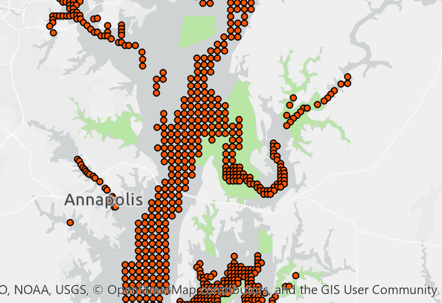

## Overview

ArcGIS mapping project showing areas within the Maryland Chesapeake where dissolved O2 levels were detected to be below 5mg/l.  This information is overlayed with current MD government data indicating the locations of Oyster sanctuaries.

Oyster restoration is a major focal area and strategy for "saving the bay" and returning the Chesapeake back to a natural state of balance.  The idea behind this map is to show **potential** areas where low levels of dissovled O2 may negatively impact oyster restoration efforts.

## ArcGIS online 

A WebMap of this project is currently hosted on ArcGIS online.
 - [MD Chesapeake Dissovled O2 - ArcGIS Web Map](https://arcg.is/0KOPra) 

## References
1. *Why oxygen dissovled in water is important*, https://www.lenntech.com/why_the_oxygen_dissolved_is_important.htm
2. *Low-oxygen zones in the shallows leave oysters more vulnerable to dermo*, https://phys.org/news/2015-02-low-oxygen-zones-shallows-oysters-vulnerable.html

