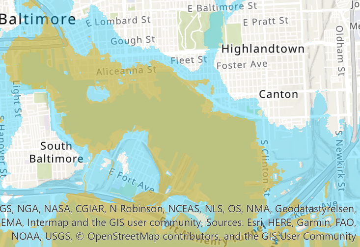

## Overview

ArcGIS mapping project showing potential storm surge for the downtown Baltimore, Inner Harbor area. The map tries to show the potential flood impact if a hurricane hit the area resulting in a 3m storm surge.  In contrast it also shows the impact for a 9m storm surge.  

The WebMap has been published to ArcGIS online (link below) but the legend is not showing correctly. 
- Orange area --> flood area for a 3m surge 
- Blue area --> flood area for a 9m surge

## ArcGIS online 

A WebMap of this project is currently hosted on ArcGIS online.
 - [Storm Surge Web Map](https://arcg.is/1ei4nH) 

## Notes
Based on this analysis the flood impact even for the 3m surge is significant:
1. Entire Inner Harbor, Harbor East and Fells Point could see flood impact
2. Alicianna St corridor is completely impacted
3. All the Piers, Baltimore Visitor Center, and Rash Field are impacted
4. Visionary Arts Museaum, Baltimore Museum of Industry and Dominos Sugar Factory impacted
5. Ft McHenry seems to be mostly spared by 3m surge, but flooded in 9m
